*这个翻译是我边学边记录的（不完全翻译，大概翻译了90%），编写成了md文件，可能有不对的地方，欢迎大家指出。**Unity Version: 6.0**，官方文档链接：https://docs.unity3d.com/6000.0/Documentation/Manual/AssetBundlesIntro.html 
您可以对照着看orz*

# 目录
<details>
<summary>点击展开查看完整目录</summary>

##### [1/13 AssetBundles介绍 （Introduction to AssetBundles）](#113-assetbundles介绍)
##### [2/13 将资源整理至AssetBundles中（Organizing assets into AssetBundles）](#213-将资源整理至assetbundles中)
##### [3/13 将资源分配至一个AssetBundle（Assign assets to an AssetBundle）](#313-将资源分配至一个assetbundle)
##### [4/13 将资源构建为AssetBundles（Build assets into AssetBundles）](#413-将资源构建为assetbundles)
##### [5/13 AssetBundle压缩格式（AssetBundle compression formats）](#513-assetbundle压缩格式)
##### [6/13 AssetBundle文件格式参考（AssetBundle file format reference）](#613-assetbundle文件格式参考)
##### [7/13 从AssetBundles中加载资源（Loading assets from AssetBundles）](#713-从assetbundles中加载资源)
##### [8/13 处理AssetBundles间的依赖（Handling dependencies between AssetBundles）](#813-处理assetbundles间的依赖)
##### [9/13 AssetBundle平台相关注意事项（AssetBundle platform considerations）](#913-assetbundle平台相关注意事项)
##### [10/13 校验已下载的AssetBundles（Verifying downloaded AssetBundles）](#1013-校验已下载的assetbundles)
##### [11/13 AssetBundle缓存（AssetBundle caching）](#1113-assetbundle缓存)
##### [12/13 优化AssetBundle内存使用（Optimizing AssetBundle memory usage）](#1213-优化assetbundle内存使用)
##### [13/13 避免冗余资源（Avoiding asset duplication）](#1313-避免冗余资源avoiding-asset-duplication)

</details>

---

# 1/13 AssetBundles介绍
AB包可用于组合资源以创建DLC，或者减少应用的初始下载大小。你还可以使用AB包加载针对特定平台优化的资源，或则降低运行时内存占用。

AB包包含特定平台非代码资源，比如模型，贴图，预制体，音频片段，或者整个场景。AB包会根据你设置的BuildTarget为特定平台构建对应格式的资源数据。比如，为IOS构建的AB包不兼容于Android。

你可以使用不同的压缩格式(LZMA 或者 LZ4)高效地分发这些归档文件。

## 使用AssetBundles的原因
使用AB包在内容分发和优化性能方面很有帮助。优势如下：

  - **动态内容交付(Dynamic content delivery)：** 在需要的时候使用AB包加载资产，对于含有DLC、章节式更新、实时服务模式的游戏很有用。它可以更好的管理内存，确保只有需要使用资产时才把它加载到内存中
  - **减少构建大小(Reduced build size)：** 把资产打包可以减少应用初始构建大小，对手机游戏或者严格限制大小的平台很重要
  - **平台兼容性(Platform compatibility)：** 你可以为不同平台创建AB包，减少程序包含特定平台资源的需求

如果你想优化资源加载，AB包就很有用了，比如仅流式加载角色附近的内容，仅加载相关的本地化内容，或在后台加载资源。然而，AB系统提供底层资产管理能力，因此你可以考虑使用Addressables包，它能提供一个更高级的管理方式。

如果你正在原型设计，或者有一个特别小的项目，你可能考虑使用资源系统(resources system)

## AssetBundle的结构
AB包类似zip文件，是一个容器文件格式。它的二进制格式文件头包含以下文件类型：

 - **序列化文件(Serialized files)：** 包含已序列化的Unity对象。这个与Player构建中使用的二进制文件格式相同。输出结果取决于AB包包含什么：
    - 仅包含资产：Unity会生成一个单独的序列化文件
    - 仅包含场景：Unity会为每个场景创建两个序列化文件。一个文件包含层级中的对象，另一个包含所有引用的对象

- **资源文件(Resource files)：** 包含为特定资产（贴图，音频等）单独存储的二进制数据块。这种分离方式允许Unity使用多线程代码从磁盘高效加载这些资源

 ## 场景AssetBundles
 不包含场景的AB是基于资源列表构建的。Unity支持将场景文件分配给AB，但你不能在单独的AB中混合场景和其他资产。在API中，这种类型的AB包称为流式场景AB包，可通过AssetBundle.isStreamedSceneAssetBundle访问。
 
 将场景构建为AssetBundles的过程与玩家构建过程中的操作类似，会重用大量相同代码。
 
---

# 2/13 将资源整理至AssetBundles中

当你创建AB包时，有一些限制和组合策略需要注意
 
这里有一些限制说明了哪些资产你可以打成AB包，你应该如何设置它们：
 
| 限制 | 描述 |
| ----- | ----- |
| **文件类型** | ● 你不能把场景和资产放进同一个AB包中。你必须单独存储包含资产的场景。<br> ● AB包中不能包含脚本资源。<br> ● 你不能将文件放入StreamingAssets文件夹中。<br> ● 你不能将资产或者场景分配给多个AB包。 |
| **命名规则** | AB包的命名必须与输出文件夹不同 |
| **平台支持** | AB包只能加载到你为其构建的特定平台上。编辑器可以加载任意的AB包，无论平台定义的Build Profile是什么，但如果编辑器安装的操作系统不支持平台特定格式，那么这些资源可能无法正常加载。|

## AssetBundle命名规范

Unity在构建过程中会自动将所有AssetBundle名称设为小写。例如，一个名为**Foo**的AB最终生成名为**foo**的文件。为了避免任何冲突或者问题，请为你的AssetBundle使用小写名称。
 
AssetBundle没有既定的文件拓展名。你在定义AB名的时候可以自定义拓展名，Unity支持。但是，这可能会与AssetBundle的差异化功能冲突，该功能要求相同根文件名搭配不同扩展名。（比如role.hd, role.lq, role）
 *【但是当你自定义扩展名role.bundle时就可能出现问题，role.bundle.hd】*
 
你可以使用```BuildAssetBundleOptions.AppendHashToAssetBundleName```标志，将AssetBundle内容的哈希值作为其文件名的一部分包含进来。这对网络托管很有用，允许同一AB的不同版本共存。
 
然而，这个标志有缺点：
 - 内置的AB缓存不会自动替换旧版本，因此同一个AB的多个版本可能会保留在缓存中
 - 这会影响主机平台上的平台升级补丁系统，因为微小的改变会被视为全新的文件而不是小型补丁
所以一般热更新，手游会使用这个标志。主机游戏一般不开。

## AssetBundle 变体

你可以使用AssetBundle变体来创建针对不同情况或配置（例如不同的图形配置）优化的AB多个版本。例如，你可以创建纹理材质低、中、高的变体以适配性能不同的设备或用户选择的图形设置。
 
当使用AB变体，Unity允许你为每个AB包指定变体名称。AB名和其变体名的组合可唯一标识每个AB变体。例如，一个名为**environment**的AB包可能有**lowQuality**, **mediumQuality**, **highQuality**的变体
 
AssetBundle内的资产文件名必须一致，但根据变体用途的不同，内容也可以有所差异。
 
你可以在**Inspector**创建变体，使用下拉框选择，或者使用```AssetImporter.assetBundleVariant```。

## 组织AssetBundles的策略

你可以通过以下方法组织你的资产：

- **按功能划分(By function)：** 根据项目的功能部分组织资产。典型类别可包括用户界面，角色，环境，和其他频繁使用的元素
- **按类型划分(By type)：** 类型分组侧重于把相同的类型组织在一起，比如音轨或本地化文件
- **运行时使用(By use at runtime)：** 将同时使用和加载的资产进行分组。这个策略经常用于关卡类项目
 
你可以在项目中混合使用这些策略以获取更好的性能。例如，你可把不同平台的UI元素组合进一个AB中，但把关卡或**场景**中的可交互内容分开打包。
 
不管你用什么方法打包，最好的实践就是遵循这些准则：

- 将频繁更新的对象和很少更改的对象分开放入不同的AB中
- 为不太可能同时加载的对象分开打包，例如标准资产和高清资产，你可以使用**AssetBundle变体**来组织
- 通常将一起卸载的对象组织在一起。例如，一个模型和它的贴图、动画
- 如果一个AssetBundle中，其资产使用不超过一半，则应该把它拆分
【*比如100个贴图，只用了40个*】
- 把内容频繁加载的小型AB包合并
- 如果一个AB包中的多个对象依赖于另一个AB包中的单个资产，可考虑将该依赖项移入独立的AB包中。同样，如果多个AB包引用同一组的资产，可考虑将这些依赖项放入共享的AB包中

## 按功能组织资产

按照资产在功能上的协作方式组织在以下情况下很适用：
- 将UI界面的所有纹理和布局数据打包
- 将一个角色的所有动画和模型打包
- 将多个关卡会共有的场景资产(贴图、模型)打包在一起
  
这些方法很适合DLC，因为你可以对项目小幅修改而无需向用户分发大量未修改的资源。然而，用这种方式时，你必须知道每个资源在项目中的使用位置和使用时机。

## 按类型组织资产

你可以把类型相似的组织起来，比如音轨或者语言本地化文件，这在更新频率低的AB场景中十分实用。
  
以这种方式对AB进行分组，在增量构建时，可减少需要更改或分发的AB包数量。不过，在运行时把所有依赖对象组装起来时可能需要下载更多的AB包。

## 按运行时用途组织资源

你可以将同时加载和使用的资产打包在一起，这在你想基于场景加载AB包时非常实用。例如，你可以用在基于关卡的游戏，每个关卡都包含独特的资产，而一个AB包包含某个场景的所有依赖项。
  
然而，这个方法意味着一个AB包中的某个资产只能在其余资产将被使用的时候使用，否则就会增加加载时间。
【*比如想使用某个关卡的音效，必须要把整个关卡的AB包加载到内存中*】
  
> [!WARNING]
> **重要：** 一个AB包中的场景会自动包含那个场景引用的全部资产，除非它们被显式地分配在单独的AB包中。如果任何一个其他场景在其他AB包中使用了这些被引用的资产，就会导致资产重复。<br><details><summary>点击展开查看一个小例子</summary>
【*bundleA有SceneA，SceneA中有一个Cube，这个Cube就会被包含在bundleA中，如果SceneB在bundleB中，它里面也有个Cube，就会将Cube打包进SceneB，此时Cube既在bundleA中又在bundleB中，被复制了一份。
现在bundleA中有SceneA和Cube，bundleB中有SceneB和Cube。这时创建一个SharedBundle，把Cube放进去就可以避免重复了。*】

---

# 3/13 将资源分配至一个AssetBundle

要将资产构建到AB包中，你必须先在Unity编辑器或者通过脚本将资产分配给AB包。接着，你可以创建并使用脚本来构建AB包。有关组织资产的最好方法参考[Organizing assets into AssetBundles](#213-将资源整理至assetbundles中).

> [!NOTE]
> **注意：** 这个工作流描述了如何通过内置的```BuildPipeline.BuildAssetBundles``` API创建资源包。另一种选择是使用Addressables包，该包基于AB包构建并提供了可视化UI界面来组织资产。

## 在编辑器中分配资产到AB包中

在Unity编辑器中把一个给定的资产分配到AB保重，需要遵循以下步骤：
  1. 选择**Project**中某个资产，看它的**Inspector**
  2. 使用**Inspector**最底部左边的下拉框分配或创建AB包：
  用 <b>/</b> 创建子文件夹，例如 **environment/forest**
  3. 右边下拉框可选来创建AB包变体

## 分配多个资产到AB包中

你可以分配一个项目中的文件夹到AB包中。默认情况下，所有那个文件夹中的资产都会被分配到相同的AB包中。但是，单个资产的AB分配优先级更高。

你也可以选中多个资源并将其分配给一个资源包。不过，通过这种方式将资源分配给资源包，会覆盖这些资源已有的任何资源包分配设置。

## 用代码分配资产

使用```BuildPipeLine.BuildAssetBundles```方法，并传入**AssetBundleBuild**结构体数组。这个方法会覆盖在Inspector中已分配的AB包。

如果你希望用Inspector管理AB包，使用```AssetDatabase.GetAllAssetBundleNames```和```AssetDatabase.GetAssetPathsFromAssetBundle```来获取所需信息并填充**AssetBundleBuild**数组。

---

# 4/13 将资源构建为AssetBundles
  
> [!NOTE]
> 此工作流程介绍了如何使用内置的 ```BuildPipeline.BuildAssetBundles API``` 创建资源包。更便捷易用的替代方案是使用 Addressables 包。

## AssetBundle 构建脚本

要构建AB包，你必须创建一个构建脚本，并把它放在**Assets**文件夹下的**Editor**文件夹中。

以下代码是AB包的构建示例脚本。它给Assets菜单添加了个一个子菜单项。当你选择**Build AssetBundles**，```BuildAllAssetBundles```方法就会调用，该方法会把所有标有AssetBundle名称的资源用于assetBundleDirctory所定义的路径下生成AB包。

```Csharp
using UnityEditor;
using System.IO;

public class CreateAssetBundles
{
    [MenuItem("Assets/Build AssetBundles")]
    static void BuildAllAssetBundles()
    {
        // Ensure the AssetBundles directory exists, and if it doesn't, create it.
        string assetBundleDirectory = "Assets/AssetBundles";
        if (!Directory.Exists(assetBundleDirectory))
            Directory.CreateDirectory(assetBundleDirectory);

        // Build all AssetBundles and place them in the specified directory.
        BuildPipeline.BuildAssetBundles(assetBundleDirectory,
                                        BuildAssetBundleOptions.None,
                                        BuildTarget.StandaloneWindows);
    }
}
```
BuildAssetBundles有以下参数
  - ```outputPath```：即assetBundleDirectory，在当前Unity项目中输出AssetBundle包的目录。这个文件夹不需要一定在Assets文件夹中。在代码示例中，它如果不存在也会创建文件夹
  - ```BuildAssetBundle.None```：构建选项参数的默认值。你可以使用这个参数来指定一个或多个标志来启用可选的行为。例如，这个参数控制压缩算法。
  - ```BuildTarget.StandaloneWindows```：定义AB包的目标平台。或者，你可以调用```EditorUserBuildSettings.activeBuildTarget```，该方法会返回当前在Unity中设置为活动状态的平台配置文件（在Build Profiles窗口中）

## 构建AssetBundles的子集

当你为```BuildPipeline.BuildAssetBundles```方法不指定AssetBundle名时，它会构建项目中的所有AB包。如果只想构建某个子集，需要查询AssetDatabase然后把定义的AssetBundles过滤后的列表传递给构建管线

下面代码解释了如何获取所有AssetBundle的名字以及它们已分配的资产，允许你在构建前筛选或修改列表：
```csharp

using UnityEditor;
using System.IO;
using UnityEngine;
using System.Collections.Generic;

public class BuildSubsetAssetBundles
{
    [MenuItem("Assets/Build Selected AssetBundles")]
    static void BuildSpecificAssetBundles()
    {
        string assetBundleDirectory = "Assets/AssetBundles";
        if (!Directory.Exists(assetBundleDirectory))
        {
            Directory.CreateDirectory(assetBundleDirectory);
        }

        List<AssetBundleBuild> builds = new List<AssetBundleBuild>();
        // 获取AssetDatabase中所有AssetBundles的名字
        string[] allAssetBundleNames = AssetDatabase.GetAllAssetBundleNames();

        // 循环查找environment开头的AB包
        foreach (string bundleName in allAssetBundleNames)
        {
            if (bundleName.StartsWith("environment"))
            {
                AssetBundleBuild build = new AssetBundleBuild
                {
                    assetBundleName = bundleName,
                    // 获取要AB包(bundleName)中所有资产的路径
                    assetNames = AssetDatabase.GetAssetPathsFromAssetBundle(bundleName)
                };
                builds.Add(build);
            }
        }

        if (builds.Count > 0)
        {
            BuildPipeline.BuildAssetBundles(assetBundleDirectory,
                                            builds.ToArray(),
                                            BuildAssetBundleOptions.None,
                                            BuildTarget.StandaloneWindows);
            Debug.Log($"Built {builds.Count} specific AssetBundles.");
        }
        else
        {
            Debug.Log("No AssetBundles matching criteria found to build.");
        }
    }

    [MenuItem("Assets/Log All AssetBundle Assignments")]
    static void LogAllAssetBundleAssignments()
    {
        string[] allAssetBundleNames = AssetDatabase.GetAllAssetBundleNames();
        Debug.Log($"Total AssetBundles Defined: {allAssetBundleNames.Length}");
        foreach (string bundleName in allAssetBundleNames)
        {
            string[] assetPaths = AssetDatabase.GetAssetPathsFromAssetBundle(bundleName);
            Debug.Log($"AssetBundle: {bundleName} (Assets: {assetPaths.Length})");
            foreach (string path in assetPaths)
            {
                Debug.Log($"  - {path}");
            }
        }
    }
}
```

*从Manifest文件中可以看到对应的信息，还有日志*
| 图 1 | 图 2 | 图 3 |
| :---: | :---: | :---: |
| 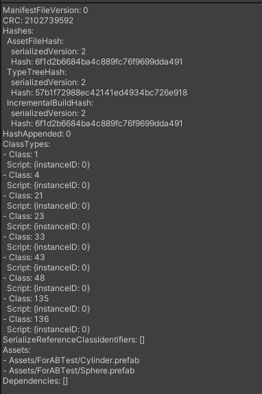 | 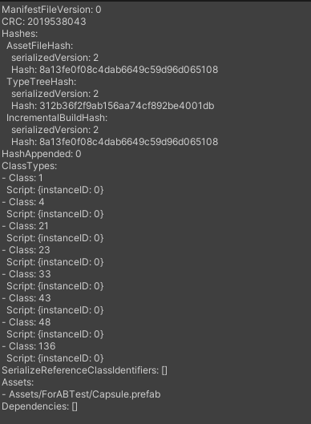 | 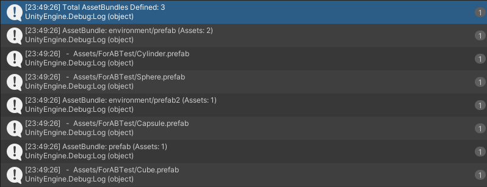 |


## 执行一次清理后的重新编译

当你创建正式的AB包发布版本时，执行一次干净的构建来确保Unity重新构建所有内容。使用```BuildAssetBundleOptions.ForceRebuildAssetBundle```标志作为**BuildPipeline.BuildAssetBundles**的可选项。

在一些项目中，你可以删掉**Library/ShaderCache**文件夹强制重新编译着色器，或者从过时的**shader**数据中回收磁盘空间。不过，删掉**ShaderCache**文件夹会增加Unity构建时间。

## 切换目标平台

```BuildPipeline.BuildAssetBundles``` API允许你指定部署AB包的目标平台和目标子平台

如果特定目标平台和**Build Profiles**配置的不同，Unity必须重新编译编辑器脚本并重新导入具有平台专属格式的贴图。构建完成后，Unity恢复原来的目标平台设置

这个过程会显著增加构建时间。另外，包含```BuildPipeline.BuildAssetBundles```调用，会继续以当前平台的编译结果继续执行，而不是以指定的构建平台。这会导致平台特定的代码或程序集出现问题

为了避免出现这个问题，确保在构建期间执行的任何代码都是动态检查目标平台的（例如，使用**if**语句），而不是依赖于特定平台的条件编译（例如，**#ifdef**宏定义语句）

最佳实践就是永远将编辑器目标平台设置为你最终想要的平台，然后再启动构建脚本来避免外部无法控制的代码引发的问题，例如第三方Package包内的构建回调。

对于命令行构建，使用<b> --buildTarget </b> 或者<b> -activeBuildProfile </b>命令行参数，让你的构建需求和目标平台保持一致。

<i>这里说了两个坑：
   - 如果编辑器再PC平台，但代码写了BuildPipeline.BuildAssetBundles("...", BuildTarget.Android)时，Unity会把项目里的贴图转换成Android平台的格式，打完AB包后再切回PC平台。显著增加构建时间 
   - C#的宏定义是代码编辑器决定的，如果编辑器在PC平台，当你点击打包脚本时有关Android的宏定义包含的脚本没有被打包，所以建议使用if语句在代码运行期间来判断【当然，最佳实践还是保证先切换平台在执行打包】
</i>

## 增量式重新构建资产

每个AB包都有一个哈希值，Unity基于这个哈希值判断是否需要重建。Unity按以下步骤决定如何进行增量构建：
  1. 如果存在该AssetBundle之前构建生成的<b>.manifest文件</b>，Unity会比较两次构建的**IncrementalBuildHash**。
  2. 如果AB的哈希值匹配，Unity接着会计算并比较它们的类型哈希树。Unity使用**TypeTreeHash**作为次级哈希来检测AB中使用的任何对象是否具有新的序列化格式。你可以用```BuildAssetBundleOptions.IgnoreTypeTreeChanges```标志来忽略此检查。
  3. 如果AB哈希和类型树哈希与上一次构建缓存不匹配，那么Unity会重新构建AB，除非你指定```BuildAssetBundleOptions.ForceRebuildAssetBundle```，这会强制重建
  4. Unity会将新计算出的哈希值序列化到新的AB的.manfiest文件中。

**IncrementalBuildHash**会考虑目标平台、包含的资源、依赖、构建选项，以及特定平台的设置（如mesh stripping和光照配置）等输入因素。但是，这个哈希并没有考虑到所有可能影响构建的可能。如果增量构建系统没有检测到某些更改，可能导致崩溃或意外失败。内部开发中使用增量构建，但在创建发布版本时执行干净的构建。

> [!WARNING]
> **警告：** **TypeTreeHash**与主**AssetBundle**输入哈希值(IncrementalBuildHash)是相互独立的。**TypeTreeHash**的改变会强制触发增量构建但却不会改变AB输入哈希值，所以AB输入哈希值不适合用来追踪文件版本（热更新比对）。更可靠的方法是使用基于内容的哈希，或其他版本编号方案。

<i>
IncrementalBuildHash：内容哈希，它关注资源本身，假设一张图的颜色变了，它就会变
TypeTreeHash：结构哈希，它关注序列化数据结构，假设预制体上的脚本新增一个字段，它就会变。

关于TypeTreeHash，当将数据结构改变时，就会强制触发一次增量构建，但不会改变IncrementalBuildHash值。
 例如：在```class Hero : MonoBehaviour```中新增一个```Defense```字段就会改变TypeTreeHash。若此时利用IncrementalBuildHash进行热更新，可能会导致游戏闪退。

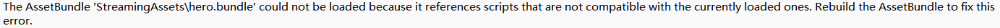
</i>

---

# 5/13 AssetBundle压缩格式

AssetBundle文件是一个归档格式，它具有以下结构：
  - 一个小型的数据头结构。这个从不压缩
  - 包含虚拟文件的内容部分，你可以选择性压缩

你可以使用以下压缩格式：
  - （全文件压缩）Full file LZMA compression
  - （基于块压缩）Chunk-based LZ4 compression
  - （不压缩）Uncompressed format

默认情况下，Unity会用LZMA压缩内容，用LZ4缓存AB包。

由于不同数据压缩的大小不同，你最好用每个支持的选项来构建你的项目并测量差异大小。

如果你要用自定义缓存方案下载并保存数据，你可以使用```AssetBundle.RecompressAssetBundleAsync```来改变压缩格式，比如在下载完毕后，把LZMA格式的AB包转换成uncompressed或者LZ4格式。

**注意：** 如果你使用Addressables，你可以在编辑器中设置压缩格式。

## LZMA 压缩

LZMA会把整个AB包的内容部分压缩成单个文件流。这种全内容压缩方案压缩后的文件比chunk-based LZ4要小。LZMA对于从CDN上下载来说是更理想的AB包压缩格式。

但是，你必须要把整个文件解压进RAM中来读取其中的资源。这个方法最好用在你需要将整个AB包的内容一次性的加载进去。例如，把一个角色或者一个场景所拥有的资源打进一个AB包中。

调用```BuildPipeline.BuildAssetBundles```时，如果没指定压缩算法，就会使用LZMA格式，例如```BuildAssetBundleOptions.None```。

**注意：** Web平台不支持LZMA压缩，请使用LZ4。

## LZ4 压缩

LZ4 使用基于块的算法，它以块为单位解压AB包。当编写AB包时，Unity会在保存前把内容按每块128KB来压缩。这个方法意味着整个压缩后AB包的大小会比LZMA更大。但是，你可以选择性的获取并加载需要的资源的那个块，而不是把整个AB包解压。

LZ4加载时间与未压缩的包相当，且具有占用磁盘空间少的优势。这个压缩格式很适合**缓存AB包**，对于作为安装包分发部分或者其他对大小不重要的时候是不错的选择。

为了使用这个格式，在调用```BuildPipeline.BuildAssetBundles```的时候指定```BuildAssetBundleOptions.ChunkBasedCompression```标志。

## Uncompressed 格式

你可以不压缩AB包，这会造成文件下载大小更大，但加载速度也更快，因为不需要解压了。如果只需要从很大的AB包中加载很少一些对象，那么不压缩的AB包就很有用。

Uncompressed AssetBundles 是16字节对齐的。使用```BuildAssetBundleOptions.UncompressedAssetBundle``` 标志构建。

## 缓存后重新压缩

分发AB包时，通常是LZMA格式。如果AB包是通过Unity内置的缓存支持(```UnityWebRequestAssetBundle```)下载的，在下载并写入缓存时，Unity会动态的把它重新压缩为LZ4格式。这个格式转变优化了客户端解压速度和加载时间。

你可以用```Caching.compressionEnabled```设置为**false**强制以uncompressed格式缓存。

---

# 6/13 AssetBundle文件格式参考

当你使用```BuildPipeline.BuildAssetBundles```来**构建AB包**时，Unity会编写以下文件到指定的输出文件夹：
  - AssetBundle文件
  - 每个AssetBundle文件对应的.manifest文件
  - manifest包

**注意：** 当你用Addressables时，只会生成AssetBundle文件。

## Unity归档文件格式

Unity归档文件格式是一个通用的打包格式，可以存储任何类型的文件，类似.zip压缩包。归档文件被**挂载**到Unity的**虚拟文件系统**上面，这使得不同平台都可以访问它们。

AB包归档文件在构建最后阶段创建。当AssetBundle**加载**时，它们被挂载到Unity的虚拟文件系统。这种归档格式同样也用于使用LZ4压缩方式构建的游戏中。在这种情况下，当游戏运行时，归档文件会被自动挂载。

通常你不需要在底层与这些归档文件交互。但是，如果需要的话Unity提供了API ```ArchiveFileInterface```来直接管理归档文件。

## AssetBundle 文件

AssetBundle包含各种在运行时要加载的资源。下面是文件布局示例图

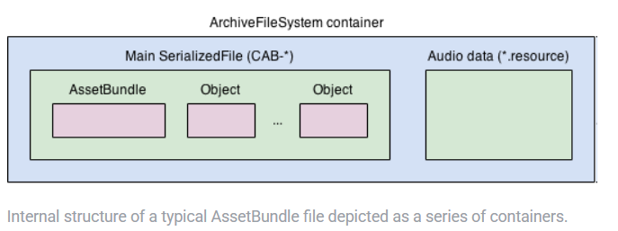

它包含一系列的嵌套容器，最外层是与AB包同名的归档文件系统。在归档文件系统内部有两个核心部分，一个是Unity序列化格式的主文件，这个文件包含**AssetBundle**对象以及包含在该包中的所有对象，另一个是带有<b>.resource</b>后缀的音频文件。

Unity在AB包中组织内容的方式称为构建布局，构建布局取决于AB包是否包含资产或者**场景**：
  - **Asset AssetBundles：** 在Unity归档文件内部，将来自资产的所有对象，包含在一个单一的序列化文件中。它还会包含被这些资产所引用的所有对象，除非另一个AB暴露了该被引用的资产【比如角色预制体用到了材质A和贴图B，Unity在打包时就会把这些自动打包进角色预制体的AB包里。如果贴图B被打包进了另一个AB包中，就不会把贴图B打包进角色的AB包】。同一个被引用的对象，可能会在多个AssetBundle中被重复打包。
  - **Scene AssetBundles：** 拥有与 **游戏本体构建(Player Build)** 相似的布局。每个场景都有一个包含该场景内对象的序列化文件，文件名类似于**PlayerBuild-SceneFileName**。这对应于游戏本体构建中的**level0**文件。Unity将场景文件中引用的资产，存储在一个**sharedasset**文件中，例如**PlayerBuild-SceneFileName.sharedasset**，除非另一个AB包暴露了被引用的资产。因为**sharedasset**的计算仅仅包含处于同一个AssetBundle内的场景，所以如果场景被存储在各自独立的AseetBundle中，而不是一起存储在一个单一的AssetBundle里，那么Unity就可能会创建出大量重复的对象。然而，将场景存储在单独的AssetBundle中，在性能和资源分发上可能会有优势。

归档文件中序列化文件的命名规则如下：
  - Asset AssetBundles将序列化文件命名为**CAB-**，后面跟着MD4哈希值作为AB包名。例如**CAB-cc6c60ef8808e0fc6663136604321554**。
  - Scene AssetBundles通过```BuildPipeline.BuildAssetBundles```创建的则使用的名称以 **PlayerBuild-** 开头，后跟场景文件名(没有路径和扩展名)。例如**Assets/Scene1.unity**会变成**PlayerBuild-Scene1**。由于这种命名约定，请为每个场景文件赋予唯一的文件名，避免冲突。
  *【不可以出现这样的情况：Assets/UI/Login.unity和Assets/Level/Login.unity】*
  - 由**Addressables**创建的场景AB包，将每个场景的序列化文件命名为**CAB-**，后跟场景在项目中的相对路径的MD4哈希值，伴随的**sharedasset**文件拥有相同的文件名，并在后加上<b>.sharedasset</b>扩展名。

与游戏本体构建一样，AssetBundle内的每个序列化文件都可以伴随一个<b>.resS</b>和<b>.resource</b>文件用来存储大型二进制数据。所有音频或视频都被存储在<b>.resource</b>文件中，而纹理和网格则被存储在<b>.resS</b>格式中。这些文件以它们所伴随的序列化文件的名称来命名，例如 **CAB-cc6c60ef8808e0fc6663136604321554.resource** 或者 **PlayerBuild-Scene1.sharedasset.resS**。

*【一些补充解释：场景打包和游戏本体构建类似，当工程里有一个场景ForAssetBundle.scene时，打成.exe后，会在Data目录下生成一个名为level0的文件，打成.bundle后，会在包内部生成一个BuildPlayer-ForAssetBundle。
打成.bundle后，场景引用的资产全部存储在
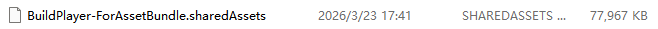
打成.exe后，
场景引用的资产全部存储在

资产打包
纹理和网格存储在.resS

这是音视频AB包内的文件
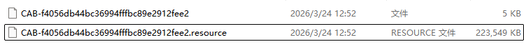
】*

## 检查AssetBundle文件内容

你可以用WebExtract和Binary2Text来提取AssetBundle的嵌套文件。

## Manifest文件

每当AB包生成时，Unity就会创建与之关联的manifest文件。这个文件拓展名是<b>.manifest</b>，你可以用任何文本编辑器打开它。
它包含以下内容：
  - 用于增量构建计算和内容校验的哈希值。
  - CRC循环冗余校验码
  - AB包中场景或者资产的清单
  - AB包所依赖的其他AB包清单，用绝对路径表示位置
  - 用于代码裁剪的类型使用信息。这个包括Unity对象，继承自MonoBehaviour和ScriptableObject的类，以及**SerializeReference**类型的使用情况。

  以下是一个 AssetBundle 清单文件内容的示例：
  ```csharp
  ManifestFileVersion: 0
UnityVersion: 6000.2.0a6
CRC: 4208470199
Compression: None
Hashes:
  AssetFileHash:
    serializedVersion: 2
    Hash: 81197c4674c1f389b3568a0aa1b41119
  TypeTreeHash:
    serializedVersion: 2
    Hash: 3c2131fb3360d17991621f547033218e
  IncrementalBuildHash:
    serializedVersion: 2
    Hash: 489e266cfc1b361a94c3efc39afecb54
HashAppended: 0
ClassTypes:
- Class: 1
  Script: {instanceID: 0}
- Class: 4
  Script: {instanceID: 0}
SerializeReferenceClassIdentifiers: []
Assets:
- Assets/Scenes/Scene2.unity
- Assets/Scenes/SampleScene.unity
Dependencies:
- C:/MyBuild/audio.bundle
- C:/MyBuild/sprites.bundle
  ```
Unity使用<b>.manifest</b>文件用于自己的**增量构建管线**。当执行一次build时，Unity会检查现有的AB包和<b>.manifest</b>文件来决定这个AB包是否需要被重新构建或者能否被重新使用。如果你删除了<b>.manifest</b>文件，那么Unity总会重新构建AB包。

加载AB包不需要Manifest文件，所以你不必发布它们。如果```BuildAssetBundleOptions.AppendHashToAssetBundleName```被使用了，那么hash值会被附加到AB包的名字后面，但这个hash不会包含进<b>.manifest</b>文件名

## Root manfiest 文件
除了为每个AB包创建的<b>.manifest</b>，Unity还会生成一个root .manifest，命名为文件夹的名字（例如，**MyBuildFolder.manifest**）。这个文件展示了生成的AB包和它们的依赖，路径相对于构建目录。它也包含了CRC。这个根清单对游戏构建时的代码裁剪至关重要，因为它的路径会被传递给```BuildPipeline.BuildPlayer```，防止AB包需要的代码类型和Unity模块被剥离。

*【代码裁剪：在Unity打包的时候，会把一些没用到的代码裁剪，减少包体大小。但是有的代码需要在AB包导入后才会使用，这时就需要这个manifest，防止有用的代码被删掉了】*

以下是一个Root manfiest文件的示例：
```csharp
ManifestFileVersion: 0
CRC: 2309754985
AssetBundleManifest:
  AssetBundleInfos:
    Info_0:
      Name: bundle_prefab
      Dependencies:
        Dependency_0: bundle_sobject
    Info_1:
      Name: bundle_sobject
      Dependencies: {}
```
## Manifest包

Unity会另外创建一个manifest bundle，是用目录命名的一个AB包。它包含**AssetBundleManifest**对象，Unity用它定义哪些依赖的包需要在运行时加载。

Manifest包同样有自己的<b>.manifest</b>文件，它记录了AB包之间的关系和它们的依赖项。这个信息和Manifest Bundle 中 AssetBundleManifest对象记录的信息类似。

Manfiest文件对于阻止AB包中未使用类型的代码被裁减很重要。如果你允许代码裁剪，在执行游戏本体构建时，设置```BuildPlayerOptions.assetBundleManifestPath```，将该清单的路径传递进去。

## Build Report

AB包构建时还会额外创建一个**BuildReport**文件，这个文件是Unity**序列化文件**，写在**Library/LastBuild.buildreport**。这个文件可用于查询每一步构建耗时和AB包的详细内容。你可以用**BuildReport** API来阅读**BuilReport**文件里的信息。

---

# 7/13 从AssetBundles中加载资源

为了加载AB包中的资产，你必须先加载AB包。

## 加载AssetBundles

你可以用以下API来加载AB包：
  - **AssetBundle**的静态加载方法，例如```AssetBundle.LoadFromFile```。这个类有一系列的加载方法，取决于你的AB包位置，以及你是否想异步或者同步加载。
  - **UnityWebRequest**支持加载AB包，例如```UnityWebRequestAssetBundle.GetAssetBundle```

## 加载资源

当AB加载后，你可以用**AssetBundle**类加载资产。

使用```LoadAsset```加载单个资产，例如
```csharp
GameObject gameObject = loadedAssetBundle.LoadAsset<GameObject>(assetName);
```
使用```LoadAllAssets```加载全部资产
```csharp
Unity.Object[] objectArray = loadedAssetBundle.LoadAllAssets();
```
这会返回一个数组，包含每个资产的根对象

这些方法要么返回对象类型要么返回对象数组。而异步的这些方法返回一个AssetBundleRequest。你必须等待操作完成才能访问资产。

异步加载单个资产
```csharp
AssetBundleRequest request = loadedAssetBundleObject.LoadAssetAsync<GameObject>(assetName);
yield return request; // or await request;
var loadedAsset = request.asset;
```
异步加载全部资产
```csharp
AssetBundleRequest request = loadedAssetBundle.LoadAllAssetsAsync();
yield return request; // or await request;
var loadedAssets = request.allAssets;
```

## 加载 AssetBundle manifests（资源清单）

你可以将AssetBundle manifest加载到**AssetBundleManifest**类的实例中，以便获取已构建的资源包，包含依赖数据，哈希数据和变体数据。

管理AB包依赖时很有用。这个manifest对象会动态寻找并加载依赖，所以你不需要显式硬编码所有AB的名字和它们的关系。

## 管理已加载的 AssetBundles

**AA（Addressables）** 包简化了管理AB包，依赖和资产的过程。但对于手动管理，理解AB包加载和卸载时机对避免内存重复或者丢失对象非常重要。

### 建议的卸载策略

```AssetBundle.Unload``` 函数从内存中移除了AssetBundle的头文件和相关结构，其bool参数值决定是否也将加载的对象卸载。

使用```AssetBundle.Unload(true)```来防止对象重复。例如：
  - 定义卸载点(Defined unload points)：在指定时机卸载临时AB包，比如关卡过渡，加载屏幕
  - 引用计数(Reference-counting)：追踪对象的使用情况，只有当所有组成对象都不使用时才会卸载。

如果你必须使用```Unload(false)```，不想要的对象可以通过下面方式来卸载：
  - 引用擦除(References elimination)：移除某个对象的所有引用并调用```Resources.UnloadUnusedAssets```
  - 非叠加场景加载(Non-additive scene)：加载一个新的非叠加场景来销毁当前场景对象，自动调用```Resources.UnloadUnusedAssets```

## 分发AssetBundles

你可以通过以下方法分发资源包：
  - 找到**StreamingAssets**文件夹并把它们包含在Player构建中。
  - 网络服务托管这些文件，例如用**Unity的Cloud Content Delivery**并使用```UnityWebRequestAssetBundle```下载它们
  - 编写自定义下载和安装代码。这个方式会增加开发工作量，但能让你在使用Unity API加载文件之前，按照自己的期望去控制压缩算法，缓存，补丁和校验。

---

# 8/13 处理AssetBundles间的依赖

当某个AB包中的对象被另一个AB包中的对象引用时就会产生依赖。如果被引用的对象没有分配给任何AB包，Unity会在构建时把它嵌入到独立的AB包中。如果多个AB包引用了相同的未分配对象，那么每个AB包都会有一个它的副本，增加内存使用。

要加载依赖的资源包，确保在访问其依赖的资源包之前，把依赖项加载进内存中。例如，如果**Bundle 1**包含了材质，这个材质引用了**Bundle 2**中的贴图，确保在访问**Bundle 1**之前，先把**Bundle 2**加载进内存中。Unity不会自动处理依赖。要在运行时管理依赖，你可以使用**AssetBundleManifest**。

## Unity如何追踪引用

Unity通过以下方式追踪AB包之间的引用：
  - **Manifest-level dependencies：** AB包之间的依赖关系在<b>.manifest</b>文件中，可以通过```AssetBundleManifest.GetAllDependencies```获取
  - **Low-level SerializedFile references：** AB包之间的直接对象引用，在**SerializedFile**的文本转储中表现为外部引用。这些低级引用不会记录AB包的名称，只会记录AB包中序列化文件的名称。它们只在相应的AB包已经加载后工作。例如：
    - **bundle0**中的一个**Material**引用**bundel1**中的**Shader**。
    - **bundle0**中的**SerializedFile**在其头部有一个外部引用表。这个表中有一个条目指向**bundle1**的**SerializedFile**路径。
    - **Material**对象的**m_Shader.m_FileID**记录了**bundle1**中与**SerializedFile**对应的外部引用表的索引。
  *【解释：shader.bundle生成一个CAB-shader233，blurEffect.shader就存放在这里，内部编号PathID为101。prefab.bundle生成一个CAB-weapon111，在weapon111的头部有一个外部索引表，对应的是CAB-shader233。在CAB-weapon111内有个材质球fire.material，记录指针m_Shader.m_FileID = 1，m_Shader.m_PathD = 101】*
  
  *以贴图示例：*
  | 图 1 | 图 2 |
| :---: | :---: |
| 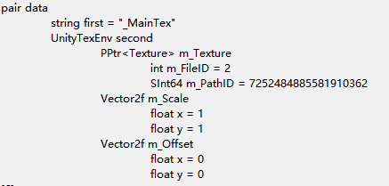 | 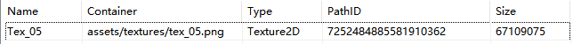 |

  *我想，m_FileID > 0时为外部引用，m_FileID = 0时则为内部引用，例如*
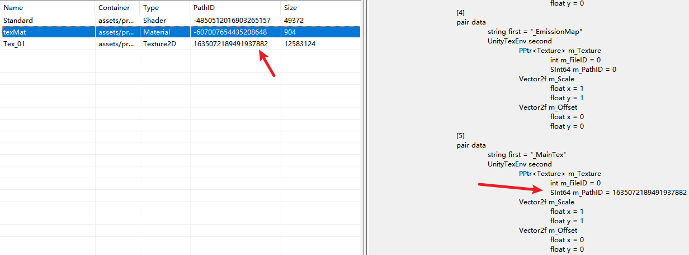
  
  - **AssetBundle object：** AB包对象整合了依赖信息到自身的**m_Container**和**m_PreloadTable**中。当需要加载某个资产时，**m_PreloadTable**会确保所有必要的对象，包括那些其他AB包里的资产，都被标记为进行加载。对于包含许多资产和依赖的AB包，这可能会涉及非常大的数据结构。
  *【这里说明了AB包最好不要打的太大，按模块、功能划分是最好的】*

## AssetBundles中的脚本类型表示

**MonoScript**对象在Unity中代表继承**MonoBehaviour**特定的类。这也包括继承自ScriptableObject的类。**MonoScript**对象将程序集，命名空间和类记录为字符串来唯一标识它们的类型。

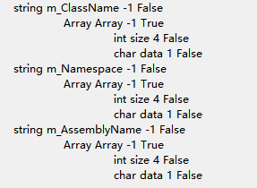

当Unity序列化一个**MonoBehaviour**对象时会记录**MonoScript**类的GUID和LFID，进而直接记录类的名称。

在构建AB包时，Unity会为参与构建的每个派生自MonoBehaviour的类包含对应的**MonoScript**对象。这些**MonoScript**对象可能与MonoBehaviour位于同一个SerilaizedFile中，也可能位于外部的序列化文件中。在这两种情况下，MonoScrip的引用机制与对象之间的其他**直接引用**机制完全相同。
*【这里是内部引用】*
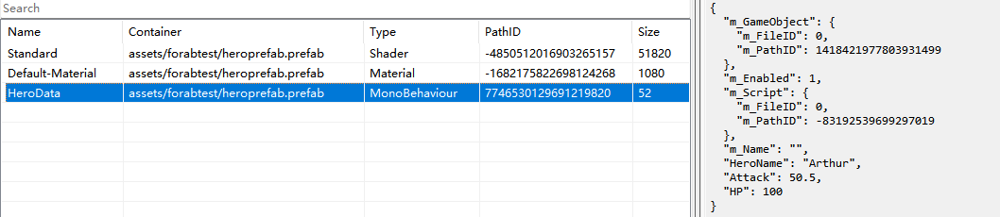

以下操作会导致MonoScript数据改变：
  - 将脚本文件移动到另一个**程序集**定义文件目录下
  - 更改包含该类的程序集定义文件的名称
  - 添加或更改类的命名空间
  - 更改类名
当发生上述更改时，请重新构建项目中的AssetBundles。
*【个人理解：由于AssetBundle里面不包含代码，而是MonoScript数据块，这里面记录了三个字符串，程序集名称，命名空间，类名。Unity执行类反射机制，在运行时解析类型，如果找不到就会产生Missing(Mono Script)错误，所以修改后必须重新构建】*

## 避免AssetBundles之间出现资源重复

默认情况下，Unity不会优化处理AB包之间的重复数据。例如，两个AB包都有一个预制体引用了同样的未分配的材质，Unity会把材质副本嵌入进每一个AB包中。这会增加安装体积，运行时内存使用情况，影响打包，因为Unity对每个副本一视同仁。

将共享的资产分配到AB包中避免重复。在构建期间，Unity会自动地将依赖项包含在已分配的AB包中。这会显著减少其他AB包大小。例如：
  - 将共享材质和它的依赖提取到**modulesmaterials**包中。
  - 预制体AB包就只会引用**modulesmaterials**包，减少它们的大小。

## 运行时加载

使用公共AB包处理共享资产时，先把依赖它的AB包加载到内存中。下面例子说明，共享的材质已正确加载因为**materialsAB**先加载了。
```csharp
using System.IO;
using UnityEngine;

public class InstantiateAssetBundles : MonoBehaviour
{
    void Start()
    {
        // Load the AssetBundles
        AssetBundle materialsAB = AssetBundle.LoadFromFile(Path.Combine(Application.dataPath, Path.Combine("AssetBundles", "modulesmaterials")));
        AssetBundle moduleAB = AssetBundle.LoadFromFile(Path.Combine(Application.dataPath, Path.Combine("AssetBundles", "example-prefab")));

        // Check for errors
        if (materialsAB == null || moduleAB == null)
        {
            Debug.Log("Failed to load AssetBundle!");
            return;
        }
        
        GameObject prefab = moduleAB.LoadAsset<GameObject>("example-prefab");
        // Instantiate the prefab
        Instantiate(prefab);
    }
}
```

## AssetBundle 卸载

当卸载AB包时，正确的处理依赖关系可以防止崩溃或者未定义的行为。当包的依赖卸载后，这个包就不能再被加载。重新单独加载依赖也会造成这个问题。当一个包被加载，它建立的数据结构已经唯一指向依赖包中的对象。如果被引用的包卸载后再重新加载，它的对象会被分配新的InstanceID，并且不会重新连接那个需要依赖的包，这会导致崩溃或序列化错误。

为了避免出现这个情况，追踪依赖且永远不要卸载被另外一个AB包引用的AB包，除非你把它们同时卸载掉。实现一个reference-counting引用计数的系统是管理AB包卸载的安全手段。

## 卸载策略例子：引用计数

实现一套引用计数系统，用于追踪资源包，并仅在其不再被使用时安全卸载资源包。

<details>
<summary>点击展开查看详情代码</summary>

```csharp
using System.Collections.Generic;
using System.IO;
using UnityEngine;

public class AssetBundleManager
{
    // Path to the directory containing AssetBundles
    private string assetBundlesDirectory;
    // The AssetBundleManifest containing dependency information
    private AssetBundleManifest assetBundleManifest;
    // Reference counts for loaded AssetBundles
    private Dictionary<string, int> assetBundleReferenceCounts = new Dictionary<string, int>();
    // Loaded AssetBundles cache
    private Dictionary<string, AssetBundle> loadedAssetBundles = new Dictionary<string, AssetBundle>();

    // Initializes the AssetBundleManager with the manifest and directory path
    public void Initialize(string manifestBundlePath, string assetBundlesDirectory)
    {
        this.assetBundlesDirectory = assetBundlesDirectory;
        AssetBundle manifestBundle = AssetBundle.LoadFromFile(manifestBundlePath);
        assetBundleManifest = manifestBundle.LoadAsset<AssetBundleManifest>("AssetBundleManifest");
        manifestBundle.Unload(false);
    }

    // Loads an AssetBundle and its dependencies, incrementing reference counts
    public AssetBundle LoadBundle(string bundlePath)
    {
        AssetBundle bundle = LoadAssetBundleIfNotLoaded(bundlePath);
        IncrementReferenceCount(bundle.name);

        string[] dependencyBundleNames = assetBundleManifest.GetAllDependencies(bundle.name);
        foreach (string dependency in dependencyBundleNames)
        {
            string dependencyBundlePath = GetAssetBundlePathFromName(dependency);
            LoadAssetBundleIfNotLoaded(dependencyBundlePath);
            IncrementReferenceCount(dependency);
        }

        return bundle;
    }

    // Loads an AssetBundle if it is not already loaded
    private AssetBundle LoadAssetBundleIfNotLoaded(string bundlePath)
    {
        if (!loadedAssetBundles.TryGetValue(bundlePath, out AssetBundle bundle))
        {
            // For simplicity, this example only shows the case of synchronous loading, but support for
            // LoadFromFileAsync() and the other load methods could also be added with similar code.
            bundle = AssetBundle.LoadFromFile(bundlePath);
            
            if (bundle == null)
            {
                throw new System.Exception($"Failed to load AssetBundle at path {bundlePath}");
            }
            loadedAssetBundles.Add(bundlePath, bundle);
        }

        return bundle;
    }

    // Unloads an AssetBundle and its dependencies if their reference counts reach zero
    public void UnloadBundle(AssetBundle bundle)
    {
        string[] dependencyBundleNames = assetBundleManifest.GetAllDependencies(bundle.name);

        DecrementReferenceCount(bundle.name);
        foreach (string dependency in dependencyBundleNames)
        {
            DecrementReferenceCount(dependency);
        }

        List<string> bundlesToUnload = new List<string>();
        foreach (KeyValuePair<string, AssetBundle> loadedBundleEntry in loadedAssetBundles)
        {
            if (assetBundleReferenceCounts[loadedBundleEntry.Value.name] <= 0)
            {
                bundlesToUnload.Add(loadedBundleEntry.Key);
            }
        }

        foreach (string bundlePath in bundlesToUnload)
        {
            loadedAssetBundles[bundlePath].Unload(true);
            loadedAssetBundles.Remove(bundlePath);
        }
    }

    // Gets the full path of an AssetBundle given its name
    private string GetAssetBundlePathFromName(string name)
    {
        return Path.Combine(assetBundlesDirectory, name);
    }

    // Increments the reference count for a given AssetBundle
    private void IncrementReferenceCount(string bundleName)
    {
        if (assetBundleReferenceCounts.ContainsKey(bundleName))
        {
            assetBundleReferenceCounts[bundleName]++;
        }
        else
        {
            assetBundleReferenceCounts[bundleName] = 1;
        }
    }

    // Decrements the reference count for a given AssetBundle
    private void DecrementReferenceCount(string bundleName)
    {
        if (assetBundleReferenceCounts.ContainsKey(bundleName))
        {
            assetBundleReferenceCounts[bundleName]--;
        }
        else 
        {
            string errorMessage = $"Attempted to decrement reference count for non-existent bundle: {bundleName}";
            throw new KeyNotFoundException(errorMessage);
        }
    }
}
```

注意：使用 **LZ4** 压缩与**未压缩**的资源包时，```AssetBundle.LoadFromFile``` 仅会将其内容目录加载至内存，而非内容本身。若要检查是否出现此情况，可使用**Memory Profiler**查看内存占用情况。

</details>

---

# 9/13 AssetBundle平台相关注意事项

AB包是平台特定的，意思就是游戏运行时，你只能加载为目标平台构建的AB包。这是因为AB包包含了特定平台的资产格式，如果加载到其他平台会导致出现未预期的行为。这个限制防止将错误内容意外分发到错误平台。

## Android 平台

为了把AB包内容分发到安卓平台，你有以下选择：
  - 把AB包构建到**StreamingAssets**文件夹中
  - 将AB包打包到自定义资源组中
  - 通过CDN部署AB包
  
  你的选择取决于你的项目需求。

## 将 AssetBundles 构建至 StreamingAssets 文件夹中

放在StramingAssets文件夹中的AB包会自动打包成APK或者OBB文件的一部分。

你不能用标准文件路径API直接从APK或OBB文件中加载这些文件。相反，你必须用```UnityWebRequestAssetBundles``` API 加上 **file:///** 的URL 方案。例如：

```csharp
var assetBundlePath = "file://" + Application.streamingAssetsPath + "/" + assetbundleToLoad;
var loadOp = UnityWebRequestAssetBundle.GetAssetBundle(assetBundlePath);
yield return loadOp.SendWebRequest();
var assetBundle = DownloadHandlerAssetBundle.GetContent(loadOp);
```

避免为**StreamingAssets**文件夹中的AB包使用LZMA压缩算法，因为将LZMA文件解压到临时内存文件的效率很低。使用LZ4压缩或者不压缩。

## 将 AssetBundles 打包至自定义资源包组中

你可以把资源包放在安卓的资产包格式中，并将它们发布给Google Play Store.

## 通过CDN部署 AssetBundles

你可以把包托管在web服务器上，并用```UnityWebRequestAssetBundle``` 下载它们。

你可以使用**Unity的CCD服务**简化部署，特别是集成了Addressables。这个方法适合大型动态的内容。下载的资源包通常会保存在应用缓存目录或者```Application.persistentDataPath```中

## 控制台下载与循环冗余校验（CRC）

通常，主机平台不会直接执行游戏内代码去下载资源包。相反，它们通常使用平台自身的DLC机制。除了对游戏的直接控制外，这些DLC被安全的购买，下载，并存储到平台的系统中。一旦安装后，游戏就会自动检测并加载这些新文件。

在主机平台加载资源包时，不要使用CRC校验码。主机平台通常CPU较弱，会花更多时间去验证重新打开的包的CRC。即使拥有高速存储的平台上，受限于CPU的CRC校验也会大幅拖慢加载速度。

---

# 10/13 校验已下载的AssetBundles

你可以随着程序发布资源包，或者从设置的远程服务器上下载

当下载资源包时，需要预防数据损坏和恶意攻击行为。下载后的资源包损坏是造成崩溃的常见原因。尽管包不能包含可执行代码，但被篡改的序列化数据可能利用程序代码漏洞或Unity运行时的漏洞。校验层可以帮助阻止随机崩溃或者不良行为。

## 使用安全协议下载

使用**UnityWebRequestAssetBundle**从远程web服务器上下载资源包。在你的URL中永远使用HTTPS，除非是在相同机器上的本地web服务器。HTTP不安全，很容易受到中间人攻击的影响。

## 循环冗余校验

为了检验AB是否损坏，你可以使用CRC来校验Unity在构建过程中生成的32位校验和。这个校验和保存在<b>.manifest</b>文件中，可以通过```BuildPipeline.GetCRCForAssetBundle```来获取。当通过```UnityWebRequestAssetBundle.GetAssetBundle```下载AB包时，提供预期的CRC值来避免无效的AB包被缓存。

如果你在Unity缓存之外直接处理AB包的下载，在获取内容之前执行完整性校验。AB包加载APIS的可选参数允许你传递CRC的值用于校验。如果计算的CRC不匹配，AB包不会加载。对于LZ4压缩的AB包，这个校验会占用大量资源，因为它需要把整个AB包解压到内存中。LZMA压缩的AB包在加载时本身就需要完全解压，所以CRC校验不会占用太多资源。为了避免加载时重复校验，在获取AB包并保存到设备上时才进行校验。
*【LZ4：整个AB包解压到内存中并不是把内容全部解压进内存中，而是每块每块的解压，其内存占用是很小的，只不过CPU会经历将整个文件解压的全过程】*

在进行AB校验时需要考虑以下：
  - 不要使用常见的hash算法（如md5）来校验**LZMA压缩**的AB包。Unity可能会在不改变内容的情况下重新压缩AssetBundle，这会导致文件哈希值发生变化，尽管内容是有效的。Unity会根据未压缩的内容计算CRC值，且这些值会在压缩后保持一致。
  【*这可能导致玩家重复下载未修改的资源】*
  - <b>.manifest</b>文件中的**IncrementalBuildHash**不是整个文件内容的哈希值。它用于版本比对，不适合文件损坏检测。
  *【这是用于编辑器打包的版本比对】*
  - <b>.manifest</b>文件中的**AssetFileHash**，可通过```BuildPipeline.GetHashForAssetBundle```来访问，是内容的哈希值。
  *【当内容改变，AssetFileHash就会改变】*

## 用户生成内容（UGC）

对于分发给其他玩家的用户生产内容，应过滤提交内容以防止不当或恶意内容。不要允许用户直接上传二进制资源包。相反，要求他们上传源资源并自己构造AB包。这个过程支持手动和自动过滤，并且在需要时允许你为新Unity重新构建资源包。

## AssetBundles补丁

当你执行了新的AB包构建，你可以用新的或者已修改的AB包更新现有的安装包，且可以删除任何未引用的AB包。对现有资源包的更新称为补丁。Unity通过**资源包缓存**支持基本的补丁功能，你也可以用```UnityWebRequestAssetBundle.GetAssetBundle```替换AB包的现有版本。然而，Unity不支持差异补丁（选择性的更新现有文件的内容以匹配新文件）。如果你想创建差异补丁，你必须编写自己的逻辑拓展或替换Unity资源包缓存。
*【差分补丁：假如bundle有500MB，现在需要修改其中的40KB贴图，玩家收到更新后，只需下载40KB而非500MB】*

使用带有不同版本或哈希参数值的```UnityWebRequestAssetBundle.GetAssetBundle```触发更新后的AB包下载。

主要挑战在于确定哪个AB包需要替换。一个补丁系统必须管理两个列表：
  - Local AssetBundles：当前下载好的AB包和它们的版本信息
  - Server AssetBundles：在服务器上可用的AB包和它们的版本信息

补丁系统会比较这两个列表，重新下载丢失或者已更新版本信息的资源包

Unityy默认情况下不支持差分更新。即使用内置的缓存系统，```UnityWebRequestAssetBundle.GetAssetBundle```也会下载整个文件。如果你需要差分更新，实现自定义下载器。Unity会以确定的方式对AB排序，因此重新构建的AB的补丁文件可以小得多。未压缩的AB或使用LZ4压缩的AB比LZMA压缩的AB具有更高的补丁效率。
*【Deterministic：确定性排序，AB包内的字节流是确定的顺序。当修改bundle中某个贴图时，通过差分算法可以得知是中间某一段字节流发生了改变，这样就能精准切出这一段进行更新】
【LZMA不能用来做差分更新，微小的改变也会导致整个包的字节序列发生巨变】*

对于自定义系统，使用JSON处理AB包文件列表，并使用<b>.NET加密API</b>来计算文件哈希值。这些哈希值可以用作版本标识符，或者如果你的构建系统支持，你也可以使用传统的版本号。

---

# 11/13 AssetBundle缓存

Unity内置的基于磁盘的缓存系统存储通过```UnityWebRequestAssetBundle```下载后的AB包，以防止重复下载。

Unity把缓存的AB包转换为LZ4格式以获取最佳性能。如果```Caching.compressionEnabled```是**false**，AssetBundles被无压缩存储。使用**Caching**类管理缓存包，例如清理或检查当前缓存。

如果你使用```UnityWebRequestAssetBundle.GetAssetBundle```，只有那些接受**Hash128**或**uint version**参数的重载方法使用内置缓存。

当不使用缓存下载时，Unity把AssetBundle下载到内存文件然后加载它。如果下载的是LZMA格式，那么Unity会把它重新压缩成LZ4格式的内存文件，然后加载它。
*【如果不使用缓存，下载500MB的包，会直接加载到内存中，后续解压再转换成LZ4，这会瞬间导致内存溢出OOM（out of memory）】*

## AssetBundle 缓存位置

本地AB包缓存有一个root文件夹（例如，```Application.temporaryCachePath```），结构类似如下：
```csharp
RootCacheFolder
- BundleName1 
  - Hash1 __data (AssetBundle content) 
  - Hash1__info (cache metadata)
- BundleName2
  - Hash2 __data 
  - Hash2 __info
```
在下载期间，Unity会为传入的数据使用一个临时目录，然后在该结构中创建重新压缩的资源包。

默认情况下，下载URL的最后一个部分会被用于缓存包的名称。要修改名字，你可以在```CachedAssetBundle.name```结构中指定它，该结构可以传递给```UnityWebRequestAssetBundle.GetAssetBundle```的重载方法。注意缓存是基于AB包名而不是整个URL。
*【在某些CDN下载可能会有特殊字符，比如"?"，一般来说是不允许。所以需要用CachedAssetBundle.name指定名字】*

## 缓存版本哈希

AB缓存系统使用哈希值作为一个AB的版本。你可以提供128位(**Hash128**)或32位(**uint**)值来区分不同的版本。可以是一个构建产生的哈希，一个数字版本号或者自定义数值。当一个新的包构建后发布，设备能正确下载新版本而不是使用旧缓存，更新版本是至关重要的。

重要：Unity不会在下载或者加载自动执行哈希计算，来验证内容是否与你提供的版本哈希相匹配。这个版本哈希仅仅是一个标识符。如果需要进行内容验证，可以使用**CRC**。
*【当然CRC也不要用，会拖垮CPU】*

你也可以使用```BuildAssetBundleOptions.ForceRebuildAssetBundle```来执行完全的重新构建，并使用```BuildAssetBundleOptions.AssetBundleStripUnityVersion```来防止在升级Unity引擎版本时导致哈希值发生改变。

## 缓存清理

Unity自动执行缓存清除。它会在启动时检查缓存，并清除过去150天内未在```Cache.expirationDelay```（缓存过期延迟）期间被访问过的所有资源包。

平台提供商为移动设备维持他们的缓存。要显式清除移动平台的缓存，使用```Cache.ClearCache```。

---

# 12/13 优化AssetBundle内存使用

加载包会消耗内存，这取决于压缩格式和访问模式。

当你加载一个包，Unity会分配内存给这个包和包体内数据。需要加载的主要的内部数据类型包括：
  - **Loading cache：** 存放AB包近期访问过的页面。通过AssetBundle.memoryBudgetKB来控制大小
  - **TypeTrees：** 定义对象的序列化布局
  - **Table of contents：** AB包内资产列表
  - **Preload table：** 每个资产的依赖列表

## TypeTree

类型树是Unity内部数据结构，描述了一个序列化二进制对象内的数据结构。从序列化系统的角度看，它作为Unity对象的模式。

每个AB中的序列化文件都有与每个对象类型对应的类型树。你可以使用类型树信息来反序列化那些类型定义可能改变的已序列化文件（例如，加入，移除，或者修改字段）

当Unity加载包，它会加载所有的类型树并在包生命周期内留在内存中。类型树内存开销主要取决于加载的独特类型数量和它们的复杂程度。每个包包含其对象一整套类型树。当多个包加载时，Unity共享AB包之间相同的类型树以减少内存使用率。

## 减少TypeTree大小

你可以通过以下方式减少AB类型树的内存要求：
  - Disable TypeTree。禁用类型树，这会把AB包类型树信息去掉，让包更小。但是，如果没有类型树，当你用新版本Unity加载旧包时，亦或者修改了你项目中的代码，你可能会得到序列化错误或者未定义行为。
  - 使用简单数据类型减少类型树复杂度。

为了测试类型树对AB包大小的影响，禁用类型树或者不禁用比对构建后大小。使用```BuildAssetBundleOptions.DisableWriteTypeTree```来禁用包中的类型树。

**注意：**一些平台需要类型树且忽略**DisableWriteTypeTree**设置。另外，不是所有平台支持类型树。

如果你禁用或者剔除类型树则需要考虑以下几点：
  - **Compatibility兼容性：** 只有当你总是将AB包和游戏本体一起重新构建时，剥离类型树才是安全的，因为这能确保类型的兼容性。这在**StreamingAssets**文件夹分发的AB包中很常见。
  *【剥离类型树后，代码修改和资源修改后，玩家必须要同时更新才能确保安全】*
  - **Editor Loading编辑器加载：** 如果你在Play模式下尝试加载没有类型树的AB包，系统会出现错误日志。这是因为编辑器和真机运行类型结构不一致。例如，MonoBehaviours在编辑器环境下有额外的字段。
  *【在开发环境下，用宏定义加载防止TypeTree报错，避免每次需要重新打包】*
  - **Debugging调试：** 在没有类型树的情况下，Unity提供的用于分析兼容性的工具非常有限。manifest中的**TypeTreeHash**很有用，**binary2text**（用<b>-typeinfo</b>标志）工具暴露了原始类型树细节作为比较。

## 内容目录表

目录表是AB包中的一个映射表，你可以用它通过名称查找每个显式包含的资源。目录表的大小会随着显式包含的资产数量，以及用于映射它们的字符串名称的长度而增加。**addressableNames**属性代表了这个字符串名称，如果没有定义该属性，则会默认使用资源的完整路径。

为了最小化用于存储目录表数据的内存量，尽量减少在特定时间加载的AB包数量。

```GetAllAssetNames```方法和```GetAllScenePaths```方法暴露了目录表映射。

*【这段说明了如果包内部资产越多，字典的条目就越多。如果打包时没有定义寻址名称，会使用完整路径，这也会增加内存占用。因此要缩短寻址名称。合理运用隐式打包可以减少目录表大小。尽量减少在特定时间加载AB包数量】*

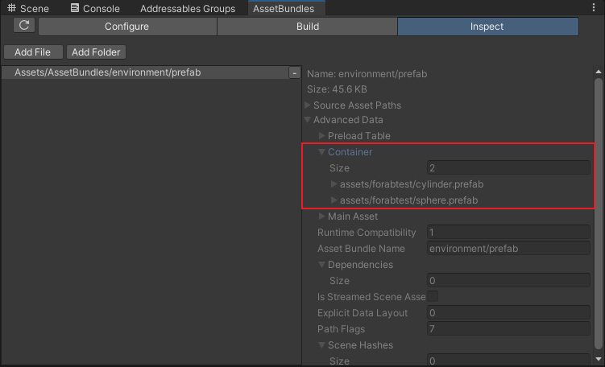

## 预加载表

预加载表列举了所有资产要加载的依赖对象。当你从包里加载某个资产时，Unity会自动使用这个表加载所有需要的依赖。

每个资产都有自己的预加载表。例如，一个预制体的预加载表包含所有依附在预制体上的组件，相关的材质和贴图，以及任何预制体用到的其他资产的条目。

每个预加载条目占用64位的内存，并且可以引用其他AB中的对象。

当一个资源引用另一个资源，而被引用的资源又引用其他资源时，预加载表会变大，因为当这些资源存在共享依赖项时，预加载表中会包含重复的条目。如果两个资源都引用了第三个资源，那么这两个资源的预加载表中都会包含加载第三个资源的条目。

预加载表可能会包含资源共享依赖项的重复条目。当一个资源引用了另一个资源，而后者又引用了其他资源时，Unity会将这些信息存储在每个资源的预加载表中。这会对内存使用产生影响。

你可以通过以下方式减少庞大预加载表的影响：
  - **只使用AB包的项目：** 把会被好多个对象频繁引用的资产显式地添加到AB包中，这样该资产的预加载信息就可以被共享了。
  - **使用可寻址系统(Addressables)或可编程构建管线(Scriptable Build Pipeline)的项目：** 避免从显式包含的资源中，直接或间接引用庞大的对象层级结构。

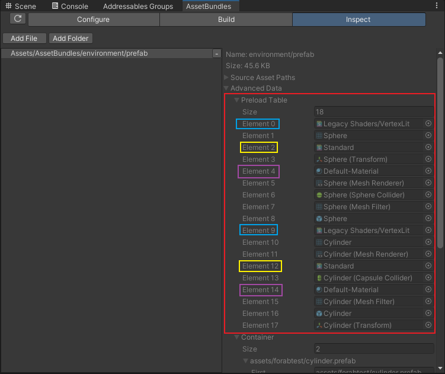

### 临时内存中的AssetBundles

Unity会高效地管理内存，但是以下场景会创建临时内存中的资源包副本：
  - 用```AssetBundle.LoadFromFile```，```LoadFromMemory```或```LoadFromStream``` APIs 加载的经由LZMA压缩的资源包
  - 下载时不使用缓存的AB包；不用版本号或哈希值作为参数下载的AB包
  - 不使用缓存系统的平台（比如Web），通过```UnityWebRequestAssetBundle```下载的AB包

临时文件会一直存在直到完全读取并且被```AssetBundle.Unload```调用。这些内存中的副本会极大增加RAM使用率和加载时间。

*【LZMA压缩率高，但是基于数据流的，仅读取某个资产也会将整个包解压到内存中】*
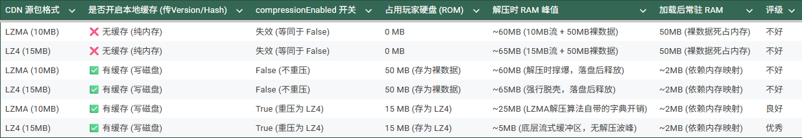

## CRC 校验和性能

对LZ4文件进行CRC校验会影响加载时间，因为CRC需要读取整个文件，要把整个文件解压。但这使用的内存极少，因为Unity会逐个解压缩每个数据块，而不是一次性解压缩整个文件。

对LZMA文件进行的CRC校验不会产生额外开销，因为完全解压是其固有的特性。

建议只在下载的时候进行CRC校验而不是每次加载的时候，尤其是CPU羸弱的平台。

## 详细的内存使用率

除了临时的资源包，其他结构也会消耗内存：
  - **LZ4 and uncompressed AssetBundles：** 当一个LZ4的包打开时，按需解压数据块。会占用内存一小部分(cache：ArchiveStorageReader.m_CachedBlocks)帮助管理连续读取。对于未压缩的包，这个缓存空间可能会被一直使用。
  - **Persistent manager SerliaizedFile cache：** **PersistentManager**使用共享缓存(**PooledFileCacherManager**)来存储从资源包内SerializedFile中读取的数据页。它的默认大小是1MB。
  *【类似页面缓存的机制？】*
  - **Archive and AssetBundle metadata：** 用于已挂载的Unity存档文件和资源包的额外数据结构，这些数据结构占用少量内存，例如包含目录表的**资源包**对象和**预加载数据**对象。
  - **PersistentManager.Remapper：** 追踪源文件和实例ID的关系。对于包含非常大的预制体（对象层次结构）的资源包，它可能会占用显著的内存，因为一旦分配，其大小就不会减小。场景中的对象不会在此处被跟踪。
  *【例如某个UI子节点非常多，一旦加载即使销毁预制体，卸载AB包这块内存仍然存在。】*
  - **Instantiated Objects：** 一旦资产和场景加载，生成的Unity对象本身也会消耗内存。

## 当Unity加载整个AssetBundle到内存中

下面总结了使用可用APIs加载不同格式的AB包时，内存中的使用和格式转换情况。这直接影响了运行时内存消耗。
  
### 基于文件的加载APIs

**AssetBundle.LoadFromFile, LoadFromFileAsync**
  - LZMA：转换为LZ4然后在内存中打开
  - LZ4和uncompressed：直接从文件中读取内容

**AssetBundle.LoadFromMemory, LoadFromMemoryAsync**
  - LZMA和uncompressed：转换为LZ4然后在内存中打开
  - LZ4：直接从内存中读取内容

**AssetBundle.LoadFromStream, LoadFromStreamAsync**
  - LZMA：转换为LZ4然后在内存中打开
  - LZ4和uncompressed：直接从文件流读取内容

### 基于Web的加载APIs

**UnityWebRequestAssetBundle.GetAssetBundle (Empty Cache, Caching.compressionEnabled = true)**
  - LZMA：下载并流式输出到缓存文件（LMZA转换为LZ4），然后从缓存中加载
  - LZ4：下载并流式传输到缓存文件（不转换），然后从缓存中加载
  - Uncompressed：下载并流式传输到缓存文件（转换为LZ4），然后从缓存中加载

**UnityWebRequestAssetBundle.GetAssetBundle (Cached, Caching.compressionEnabled = true)**
  - 所有压缩格式：直接从缓存的LZ4文件中读取内容

**UnityWebRequestAssetBundle.GetAssetBundle (No Caching)**
  - LZMA：下载并转换为LZ4，然后打开内存中文件
  - LZ4和uncompressed：下载并流式传输到基于内存的临时文件（不转换）

**Note：** 转换并打开内存中的文件，涉及一系列操作：打开源数据、检查其格式、将其转换为LZ4（如果 ```Caching.compressionEnabled```为 **false**则保持未压缩）并存为一个内存归档文件、打开这个内存文件，最后在调用卸载（Unload）且没有任何读取器在使用它时将其删除。这个过程会极其低效地消耗内存和加载时间。

## 降低含有大量资源的AssetBundles的运行时内存使用率

在加载资源时，Unity 支持通过完整的项目相对路径、文件名、或者不带扩展名的文件名来进行加载。后两种选项是通过构建额外的字符串表来实现的。在包含大量可加载资源的 AssetBundle 中，这些额外的字符串表可能会消耗显著的内存。
*【如果有10000个资产，原本只需要10000个字符串，现在却有20000个冗余字符串】*

为了减少这种开销，最佳实践是始终使用它们的确切键值（项目相对路径或 Addressables 名称）来加载资源，并在构建（打包）时禁用这些额外的匹配功能：
  - **```BuildAssetBundleOptions.DisableLoadAssetByFileName```** （禁用通过文件名加载）
  - **```BuildAssetBundleOptions.DisableLoadAssetByFileNameWithExtension```** （禁用通过带扩展名的文件名加载）

---

# 13/13 避免冗余资源

资源重复，发生在当Unity递归地追踪**直接引用**，来确保所有需要的对象被包含在构建中。资源和场景在不同的构建之间是不共享的，因此相同的内容可能会同时在游戏本体构建和使用**AssetBundles**或**Addressables**制作的纯内容构建中被重复打包。对于小对象来说，这不是什么大问题，但对于纹理或网格等大型资源而言，这会导致构建体积变得庞大。
*【例如随着游戏本体发布的场景中有一个贴图占了10MB，然后后续有个关卡被打成bundle_DLC，里面也用到了这个贴图，就会造成资源重复*】

## 使用 AssetBundles 或者 Addressables 最小化资源重复

为了避免或最小化资源重复，你可以尽量减少游戏本体构建，并把内容全部放进**AssetBundles**或**Addressables**。

要创建一个最小的游戏本体，仅包含一个初始场景，该场景仅包含一个MonoBehaviour脚本，用AB或AA的APIs来加载余下内容。你也应该避免把任何资产（该资产同时用于纯内容构建）放进**Resources**文件夹中。你可以把AB或AA构建的与游戏本体构建的一起发布，使用**StreamingAssets**文件夹，或者托管在CDN上。

## AssetBundles中的冗余资源

当对象被打包成AB时，Unity用**Asset Database**来查询该对象的所有依赖项。Unity利用这些依赖项信息来决定要将哪些对象包含在AB中。

AssetBundle的分配是在资产级别进行的。显式分配给某个AB的资产对象，将仅仅包含在该特定的AB中。根据所使用的```BuildPipeline.BuildAssetBundles```方法，你可以通过将资产的```AssetImporter.assetBundleName```属性设置为非空字符串，或者将其列入```AssetBundleBuild.assetNames```列表中来进行显式分配。

不同AB包引用同一个资产可能会导致重复。如果这个资产不显式地分配给一个AB包，那么Unity就会复制资产的副本到每个AB包中。

例如，如果两个对象被分配到了不同的 AssetBundle 中，但它们共享了对同一个依赖对象的引用，Unity 就会把这个依赖对象复制到这两个 AssetBundle 里。 这些被复制的依赖项同时也会被实例化（instanced），这意味着这两个副本会被当成拥有独立唯一标识符的完全不同的对象。这不仅增加了应用程序 AssetBundles 的总体积，而且当这两个父 AssetBundle 都被加载时，还会导致内存中同时加载了该对象的两份独立副本。

为了防止这情况发生，请确保将共享资产显式分配给一个AB。
